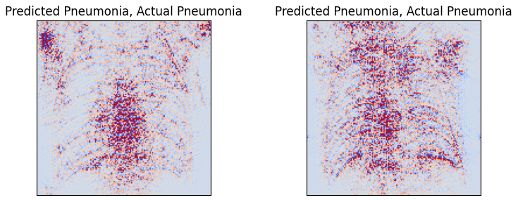
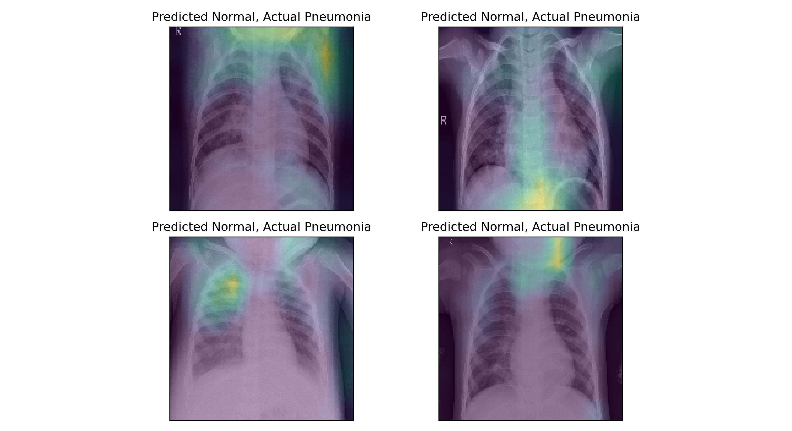
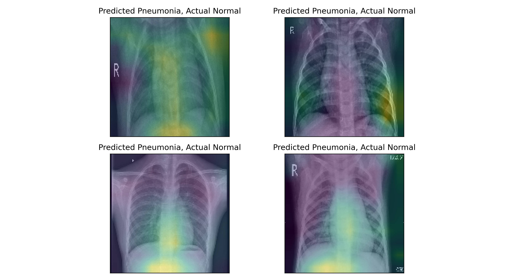

## Pneumonia Detection in Chest X-Rays using CNN and Grad-CAM
A group project with Avan Salman.

### Problem
Detect pneumonia from chest X-ray images

## Approach
- Convolutional Neural Network (CNN) for image classification
- Model interpretability with Grad-CAM and guided Grad-CAM
- Hyperparameter optimization using Optuna
- Baseline model using RandomForest

## Results
- Test accuracy: 0.92, F1 score: 0.91
- Improved baseline model performance (baseline: https://www.kaggle.com/code/madz2000/pneumonia-detection-using-cnn-92-6-accuracy) 
- Increased recall for the minority class (normal) from 0.77 -> 0.86
- Minimal trade-off: recall for majority class decreased from 0.96 -> 0.95
- Added interpretability through Grad-CAM and guided Grad-CAM visualizations

## My contribution
- Implemented and tested the baseline model architecture and training pipeline
- Developed an alternative Random Forest baseline
- Implemented Grad-CAM and guided Grad-CAM for interpretability
- Worked together with Avan on model evaluation and error analysis 

## Grad-CAM results

